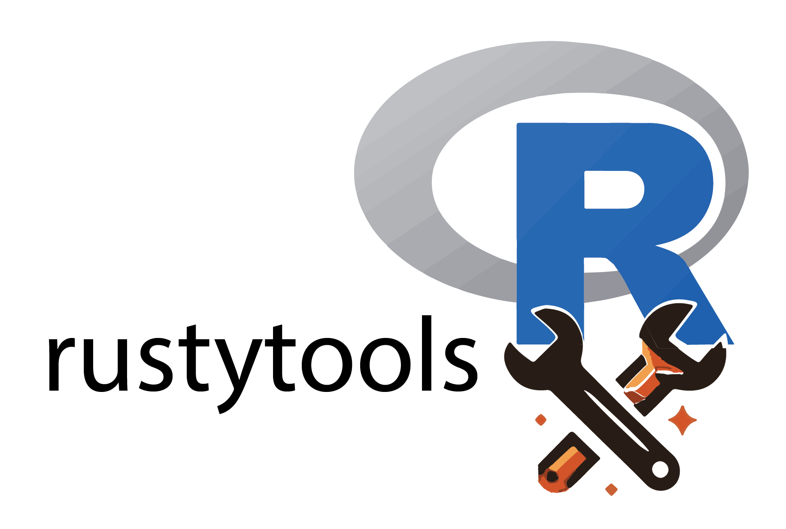

<hr>
<p align="left"></a></p>
<hr>

[](https://www.repostatus.org/#active)
[](https://lifecycle.r-lib.org/articles/stages.html)

rustytools is under development.  Please check back for updates. For now, we have implemented one function get_consensus.


## Installation

First you need to have an updated Rust installation. Go to this [site](https://www.rust-lang.org/tools/install) to learn how to install Rust.

To install mergebamsR:

```r
remotes::install_github("furlan-lab/rustytools")
```

## How to start

We have a vignette for our one function...

- `vignette("getConsensus")` to explore our bountiful package. 


## License 

MIT license.

## Acknowledgements

Written by Scott Furlan.

<p align="center"></a></p>
<hr>

